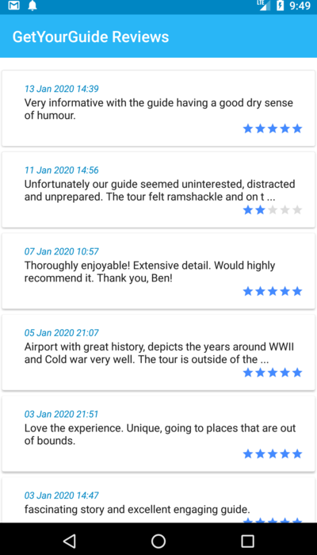

# GetYourGuide-Test
&nbsp;&nbsp;&nbsp;&nbsp;A test Android native application which demonstrates the use of core android development 
features and design modalities. It relies on the MVVM architecture and supported by the clean code pattern.

### Purpose

 This app basically displays a list of reviews from different users 
of one the most popular popular [Berlin tours](https://www.getyourguide.com/berlin-l17/tempelhof-2-hour-airport-history-tour-berlin-airlift-more-t23776/)
in the world today. 

### Functionality
This test android application does just 3 things

- A user is able to see a list of reviews for the above mentioned tour.
- A user is able to scroll through the long list supported by pagination.
- A user is able to perform click events of the items on the list to view their details.

### TechStack
 The main Techonogies and tools used here are
 
* Java Programming Language
* Dagger2 (for Dependency Injection)
* RxJava (for Concurrency and asynchronous API calls)
* Retrofit (for Rest API consumption)
* Pagination Library
* Data Binding
* Facebook Shimmer Effect Library ( For placeholder loading before recyclerview receives data)

The APIs used in this app for fetching the relevant data are provided by GetYourGuide Travelers Company, Germany.

#### Enjoy

 &nbsp;&nbsp;&nbsp;&nbsp; 
